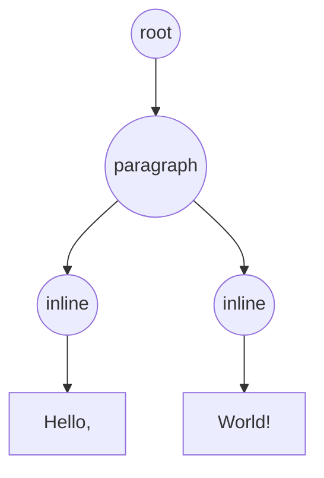
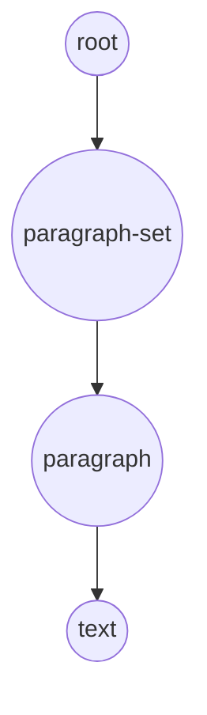

# Penpot Text Editor

## How to run it

### Development

To start the development environment run:

```sh
yarn run dev
```

### Testing

For running unit tests and running coverage:

```sh
yarn run test
yarn run coverage
```

> If you want, you can run the [vitest](https://vitest.dev/) UI by running:

```sh
yarn run test:ui
```

## How to build it

The editor can be built and updated inside Penpot using the following command:

```sh
PENPOT_SOURCE_PATH=/path/to/penpot/repository yarn build:update
```

This command is going to search for the file located in `frontend/src/app/main/ui/workspace/shapes/text/new_editor/TextEditor.js` and update it.

## How it works?

The text editor divides the content in three elements: `root`, `paragraph` and `inline`. An `inline` in terms of content is a styled element that it is displayed in a line inside a block and an `inline` only can have one child (a Text node). A `paragraph` is a **block** element that can contain multiple `inline`s (**inline** elements).

```html
<div data-itype="root">
  <div data-itype="paragraph">
    <span data-itype="inline">Hello, </span>
    <span data-itype="inline" style="font-weight: bold">World!</span>
  </div>
</div>
```

This way we only need to deal with a structure like this, where circular nodes are `HTMLElement`s and square nodes are `Text`. Also with an structure like this we have a predictable and ordered tree where we can find our position easily to do any operation (remove, insert, replace, etc).



This is compatible with the way Penpot stores text content.



## How the code is organized?

- `editor`: contains everything related to the TextEditor. Where `TextEditor.js` is the main file where all the basic code of the editor is handled. This has been designed so that in the future, when the Web Components API is more stable and has features such as handling selection events within shadow roots we will be able to update this class with little effort.
- `editor/clipboard`: Event handlers for clipboard events.
- `editor/commands`: Event handlers for input events (commands) that modifies the content of the TextEditor.
- `editor/content`: Code related to handling elements like text nodes, paragraphs, line breaks, etc. This are a series of utility functions that can perform some verifications and mutations on DOM nodes.
- `editor/controllers`: There are two controllers; `ChangeController` that handles when a change in the content should be notified and `SelectionController` that handles operations on selections and text, this is where all the mutations on DOM nodes are performed.

## Implementation

Everything is implemented in JavaScript using `beforeinput` and `InputEvent` for the user events. `blur` and `focus` are used to handle imposter selections.

### Why imposter selections?

Normally when you click on another UI element, the current selection is replaced by the selection of the new UI element.

## References

- [InputEvent](https://w3c.github.io/input-events/#interface-InputEvent): the main event used for handling user input.
- [Selection](https://developer.mozilla.org/en-US/docs/Web/API/Selection): for handling selections.
- [Range](https://developer.mozilla.org/en-US/docs/Web/API/Range): for handling range selections. <sup>1</sup>
- [Node](https://developer.mozilla.org/en-US/docs/Web/API/Node): for operator functions like `compareDocumentPosition` or `nodeType`.
- [Text](https://developer.mozilla.org/en-US/docs/Web/API/Range): for operator functions like `splitText`.
- [Element](https://developer.mozilla.org/en-US/docs/Web/API/Element): for operator functions like `after`, `before`, `append`, `remove`, `prepend`, etc.

<sup>1</sup>: Firefox is the only browser right now (2024-07-08) that has support for multiple selection ranges so we have to deal with this special case removing old ranges.

## For future reference

In a near future maybe we could take a lot at the [EditContext API](https://developer.mozilla.org/en-US/docs/Web/API/EditContext_API).

## FAQ

### Sometimes I receive 'TypeError: Cannot read from private field'

Sometimes, when you update the TextEditor source code, this exception could raise because shadow-cljs updated the code but keeps a reference to the old instance of the text editor, so the new code tries to read a private field from an old instance.
