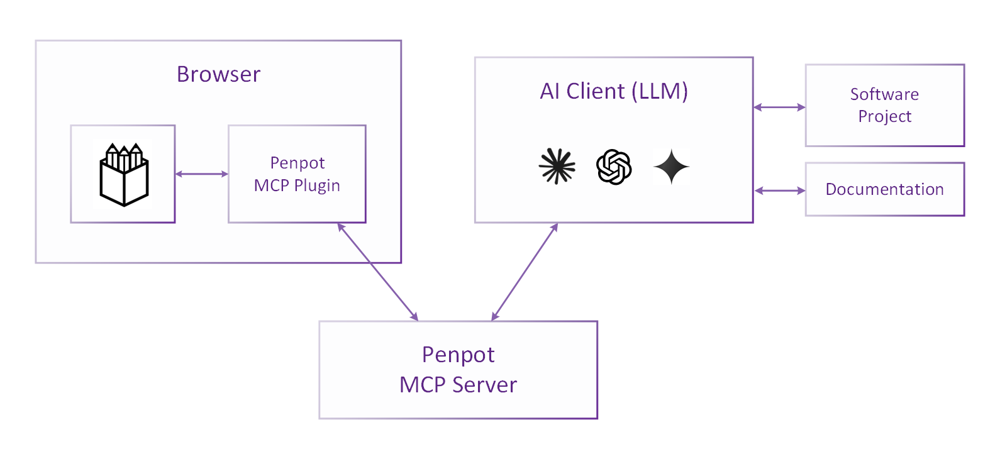

# Penpot's Official MCP Server

Penpot integrates a LLM layer built on the Model Context Protocol
(MCP) via Penpot's Plugin API to interact with a Penpot design
file. Penpot's MCP server enables LLMs to perfom data queries,
transformation and creation operations.

Penpot's MCP Server is unlike any other you've seen. You get
design-to- design, code-to-design and design-code supercharged
workflows.


[](https://www.youtube.com/playlist?list=PLgcCPfOv5v57SKMuw1NmS0-lkAXevpn10)


## Architecture

The **Penpot MCP Server** exposes tools to AI clients (LLMs), which
support the retrieval of design data as well as the modification and
creation of design elements.  The MCP server communicates with Penpot
via the dedicated **Penpot MCP Plugin**,
which connects to the MCP server via WebSocket.  
This enables the LLM to carry out tasks in the context of a design file by 
executing code that leverages the Penpot Plugin API.
The LLM is free to write and execute arbitrary code snippets
within the Penpot Plugin environment to accomplish its tasks.



This repository thus contains not only the MCP server implementation itself
but also the supporting Penpot MCP Plugin 
(see section [Repository Structure](#repository-structure) below).

## Demonstration

[](https://v32155.1blu.de/penpot/PenpotFest2025.mp4)


## Usage

To use the Penpot MCP server, you must
 * run the MCP server and connect your AI client to it,
 * run the web server providing the Penpot MCP plugin, and
 * open the Penpot MCP plugin in Penpot and connect it to the MCP server. 

Follow the steps below to enable the integration.


### Prerequisites

The project requires [Node.js](https://nodejs.org/) (tested with v22.x
with corepack).

Following the installation of Node.js, the tools `pnpm` and `npx`
should be available in your terminal. For ensure corepack installed
and enabled correctly, just execute the `./scripts/setup`.

It is also required to have `caddy` executeable in the path, it is
used for start a local server for generate types documentation from
the current branch. If you want to run it outside devenv where all
dependencies are already provided, please download caddy from
[here](https://caddyserver.com/download).

You should probably be using penpot devenv, where all this
dependencies are already present and correctly setup. But nothing
prevents you execute this outside of devenv if you satisfy the
specified dependencies.


### 1. Build & Launch the MCP Server and the Plugin Server

If it's your first execution, install the required dependencies:

```shell
cd mcp/
./scripts/setup
```

Then build all components and start the two servers:

```shell
pnpm run bootstrap
```

This bootstrap command will:

  * install dependencies for all components (`pnpm -r run install`)
  * build all components (`pnpm -r run build`)
  * build plugins types  (`pnpm run build-types`)
  * start all components (`pnpm -r --parallel run start`)

If you want to have types scrapped from a remote repository, the best
apprach is executing the following:

```shell
PENPOT_PLUGINS_API_DOC_URL=https://doc.plugins.penpot.app pnpm run build:types
pnpm run bootstrap
```

Or this, if you want skip build step bacause you have already have all
build artifacts ready (per example from previous `bootstrap` command):

```
PENPOT_PLUGINS_API_DOC_URL=https://doc.plugins.penpot.app pnpm run build:types
pnpm run start
```

If you want just to update the types definitions with the plugins api doc from the
current branch:

```shell
pnpm run build:types
```

(That command will build plugins doc locally and will generate the types yaml from
the locally build documentation)

### 2. Load the Plugin in Penpot and Establish the Connection

> [!NOTE]
> **Browser Connectivity Restrictions**
>
> Starting with Chromium version 142, the private network access (PNA) restrictions have been hardened,
> and when connecting to `localhost` from a web application served from a different origin
> (such as https://design.penpot.app), the connection must explicitly be allowed.
>
> Most Chromium-based browsers (e.g. Chrome, Vivaldi) will display a popup requesting permission
> to access the local network. Be sure to approve the request to allow the connection.
>
> Some browsers take additional security measures, and you may need to disable them.
> For example, in Brave, disable the "Shield" for the Penpot website to allow local network access.
>
> If your browser refuses to connect to the locally served plugin, check its configuration or
> try a different browser (e.g. Firefox) that does not enforce these restrictions.

1. Open Penpot in your browser
2. Navigate to a design file
3. Open the Plugins menu
4. Load the plugin using the development URL (`http://localhost:4400/manifest.json` by default)
5. Open the plugin UI
6. In the plugin UI, click "Connect to MCP server".
   The connection status should change from "Not connected" to "Connected to MCP server".
   (Check the browser's developer console for WebSocket connection logs.
   Check the MCP server terminal for WebSocket connection messages.)

> [!IMPORTANT]
> Do not close the plugin's UI while using the MCP server, as this will close the connection.

### 3. Connect an MCP Client

By default, the server runs on port 4401 and provides:

- **Modern Streamable HTTP endpoint**: `http://localhost:4401/mcp`
- **Legacy SSE endpoint**: `http://localhost:4401/sse`

These endpoints can be used directly by MCP clients that support them.
Simply configure the client to connect the MCP server by providing the respective URL.

When using a client that only supports stdio transport,
a proxy like `mcp-remote` is required.

#### Using a Proxy for stdio Transport

NOTE: only relevant if you are executing this outside of devenv

The `mcp-remote` package can proxy stdio transport to HTTP/SSE, 
allowing clients that support only stdio to connect to the MCP server indirectly.

1. Install `mcp-remote` globally if you haven't already:

        npm install -g mcp-remote

2. Use `mcp-remote` to provide the launch command for your MCP client:

        npx -y mcp-remote http://localhost:4401/sse --allow-http

#### Example: Claude Desktop

For Windows and macOS, there is the official [Claude Desktop app](https://claude.ai/download), which you can use as an MCP client.
For Linux, there is an [unofficial community version](https://github.com/aaddrick/claude-desktop-debian).

Since Claude Desktop natively supports only stdio transport, you will need to use a proxy like `mcp-remote`.
Install it as described above.

To add the server to Claude Desktop's configuration, locate the configuration file (or find it via Menu / File / Settings / Developer):

- **Windows**: `%APPDATA%/Claude/claude_desktop_config.json`
- **macOS**: `~/Library/Application Support/Claude/claude_desktop_config.json`
- **Linux**: `~/.config/Claude/claude_desktop_config.json`

Add a `penpot` entry under `mcpServers` with the following content: 

```json
{
    "mcpServers": {
        "penpot": {
            "command": "npx",
            "args": ["-y", "mcp-remote", "http://localhost:4401/sse", "--allow-http"]
        }
    }
}
```

After updating the configuration file, restart Claude Desktop completely for the changes to take effect.

> [!IMPORTANT] 
> Be sure to fully quit the app for the changes to take effect; closing the window is *not* sufficient.   
> To fully terminate the app, choose Menu / File / Quit.

After the restart, you should see the MCP server listed when clicking on the "Search and tools" icon at the bottom
of the prompt input area.

#### Example: Claude Code

To add the Penpot MCP server to a Claude Code project, issue the command

    claude mcp add penpot -t http http://localhost:4401/mcp

## Repository Structure

This repository is a monorepo containing four main components:

1. **Common Types** (`common/`):
    - Shared TypeScript definitions for request/response protocol
    - Ensures type safety across server and plugin components

2. **Penpot MCP Server** (`mcp-server/`):
    - Provides MCP tools to LLMs for Penpot interaction
    - Runs a WebSocket server accepting connections from the Penpot MCP plugin
    - Implements request/response correlation with unique task IDs
    - Handles task timeouts and proper error reporting

3. **Penpot MCP Plugin** (`penpot-plugin/`):
    - Connects to the MCP server via WebSocket
    - Executes tasks in Penpot using the Plugin API
    - Sends structured responses back to the server#

4. **Helper Scripts** (`python-scripts/`):
    - Python scripts that prepare data for the MCP server (development use)

The core components are written in TypeScript, rendering interactions with the
Penpot Plugin API both natural and type-safe.

## Configuration

The Penpot MCP server can be configured using environment variables. All configuration
options use the `PENPOT_MCP_` prefix for consistency.

### Server Configuration

| Environment Variable               | Description                                                                | Default      |
|------------------------------------|----------------------------------------------------------------------------|--------------|
| `PENPOT_MCP_SERVER_LISTEN_ADDRESS` | Address on which the MCP server listens (binds to)                         | `localhost`  |
| `PENPOT_MCP_SERVER_PORT`           | Port for the HTTP/SSE server                                               | `4401`       |
| `PENPOT_MCP_WEBSOCKET_PORT`        | Port for the WebSocket server (plugin connection)                          | `4402`       |
| `PENPOT_MCP_REPL_PORT`             | Port for the REPL server (development/debugging)                           | `4403`       |
| `PENPOT_MCP_SERVER_ADDRESS`        | Hostname or IP address via which clients can reach the MCP server          | `localhost`  |
| `PENPOT_MCP_REMOTE_MODE`           | Enable remote mode (disables file system access). Set to `true` to enable. | `false`      |

### Logging Configuration

| Environment Variable   | Description                                          | Default  |
|------------------------|------------------------------------------------------|----------|
| `PENPOT_MCP_LOG_LEVEL` | Log level: `trace`, `debug`, `info`, `warn`, `error` | `info`   |
| `PENPOT_MCP_LOG_DIR`   | Directory for log files                              | `logs`   |

### Plugin Server Configuration

| Environment Variable                      | Description                                                                             | Default      |
|-------------------------------------------|-----------------------------------------------------------------------------------------|--------------|
| `PENPOT_MCP_PLUGIN_SERVER_LISTEN_ADDRESS` | Address on which the plugin web server listens (single address or comma-separated list) | (local only) |

## Beyond Local Execution

The above instructions describe how to run the MCP server and plugin server locally.
We are working on enabling remote deployments of the MCP server, particularly
in [multi-user mode](docs/multi-user-mode.md), where multiple Penpot users will
be able to connect to the same MCP server instance.

To run the server remotely (even for a single user),
you may set the following environment variables to configure the two servers
(MCP server & plugin server) appropriately:
 * `PENPOT_MCP_REMOTE_MODE=true`: This ensures that the MCP server is operating
   in remote mode, with local file system access disabled.
 * `PENPOT_MCP_SERVER_LISTEN_ADDRESS` and `PENPOT_MCP_PLUGIN_SERVER_LISTEN_ADDRESS`:
   Set these according to your requirements for remote connectivity.
   To bind all interfaces, use `0.0.0.0` (use caution in untrusted networks).
 * `PENPOT_MCP_SERVER_ADDRESS=<your-address>`: This sets the hostname or IP address
   where the MCP server can be reached. The Penpot MCP Plugin uses this to construct
   the WebSocket URL as `ws://<your-address>:<port>` (default port: `4402`).
