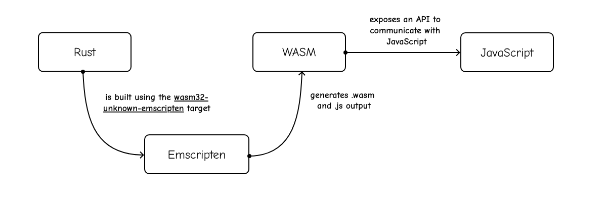
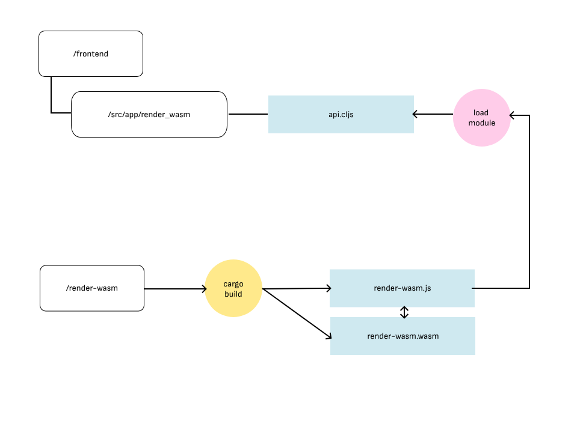

# Penpot WASM render

This is the canvas-based WebAssembly render engine for Penpot.

## Rust & Emscripten 

This project is a Rust crate that targets [Emscripten](https://emscripten.org/) (`wasm32-unknown-emscripten`).

We use `wasm32-unknown-emscripten` compilation target:
* It compiles Rust code into WASM
* It generates the JavaScript code (“glue”) to load and run the WASM code



### Skia

We use Skia, an Open Source 2D graphics library. In particular, the render engine uses Skia via [custom binaries](https://github.com/penpot/skia-binaries/releases/) of the [rust-skia crate](https://github.com/rust-skia/rust-skia).

## How to build

With the [Penpot Development Environment](https://help.penpot.app/technical-guide/developer/devenv/) running, create a new tab in the tmux.

```sh
cd penpot/render-wasm
./build
```

You can also use `./watch` to run the build on every change.

The build script will compile the project and copy the `.js` and `.wasm` files to their correct location within the frontend app.




Edit your local `frontend/resources/public/js/config.js` to add the following flags:

- `enable-feature-render-wasm` to enable this render engine.
- `enable-render-wasm-dpr` (optional), to enable using the device pixel ratio.

## How to test

We currently have two types of tests:

- Unit tests

```sh
cd penpot/render-wasm
./test
```

- [Visual Regression Test](./docs/visual_regression_tests.md)

## Technical documentation

- [Serialization](./docs/serialization.md)
- [Tile Rendering](./docs/tile_rendering.md)
- [Texts](./docs/texts.md)
