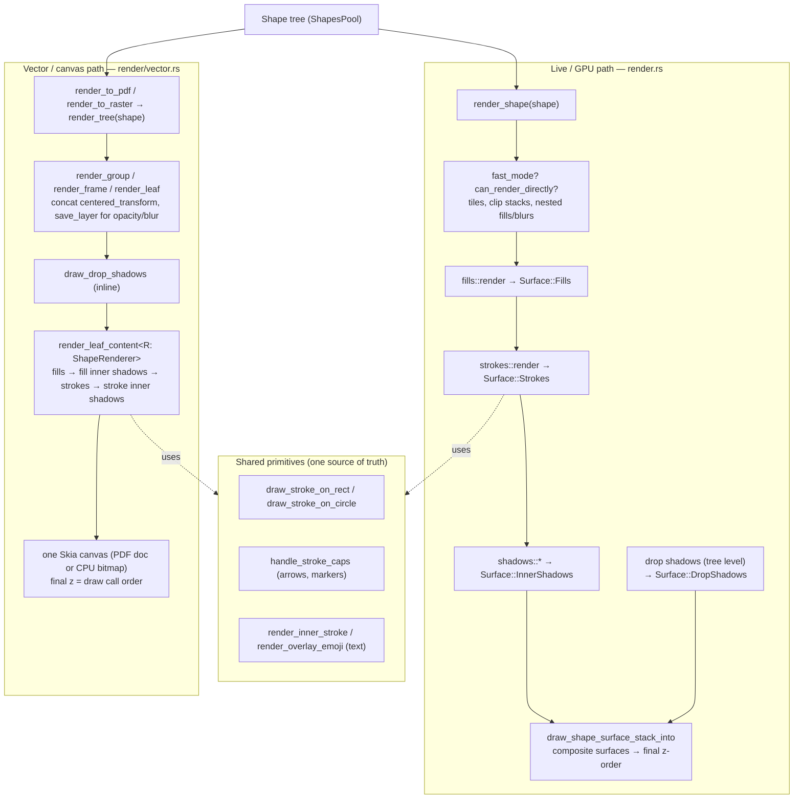

# Rendering Architecture: Live (GPU) vs Vector/Canvas Export

Penpot's WASM engine has **two render paths** that must produce the same picture:

| Path | Purpose | Backend | Code |
|------|---------|---------|------|
| **Live / GPU** | On-screen workspace, thumbnails, PNG export | WebGL surfaces + Skia | `render.rs::render_shape` (+ `render/{fills,strokes,shadows,text,...}.rs`) |
| **Vector / canvas** | Vector PDF and raster PNG export, runnable headless (no GPU) | Single CPU Skia canvas | `render/vector.rs` → `render/pdf.rs`, `render/raster.rs` |

They share the same shape tree and the same low-level drawing primitives, but
compose them differently. Keeping them in sync is the whole game — see
[Parity guards](#parity-guards).

The vector/canvas path drives the same `render_tree` onto two surface kinds — a
PDF document (`render/pdf.rs`) or a CPU bitmap (`render/raster.rs`) — and, since
it never touches GPU surfaces, it can also run with **no GL context at all**
(see [Headless mode](#headless-gpu-free-mode)).

## Why two paths?

The live path draws each shape into **many intermediate GPU surfaces** (fills,
strokes, shadows, …) and composites them. Compositing rasterises. That is fine
for the screen and for PNG, but a PDF made that way would be a bitmap.

The vector path bypasses the GPU surface system and draws **directly onto a
single Skia canvas**, so for PDF output paths, text and fills come out as real
PDF vector operations (only inherently pixel-based effects — blur, blurred
shadows — are rasterised, by Skia's PDF backend). The same draw path onto a
CPU raster surface (`render/raster.rs`) gives a PNG without a GPU, which is also
what makes a browser-less / server-side render possible.

## The two pipelines

### Key differences

| Aspect | Live / GPU | Vector |
|--------|-----------|--------|
| Drawing target | Many GPU surfaces, then composited | One Skia PDF canvas |
| Final z-order | Surface composite order (`draw_shape_surface_stack_into`) | Order of draw calls |
| Drop shadows | Rendered at tree level into a separate surface (`render_element_drop_shadows_and_composite`) | Drawn inline per shape/container (`draw_drop_shadows` / `render_container_drop_shadows`) |
| Images | GPU textures | CPU image copies (`get_cpu_image`) |
| Blur / blurred shadow | GPU filter passes | Rasterised by Skia's PDF backend |
| Perf machinery | tiles, `fast_mode`, `can_render_directly` | none (one-shot export) |

## Headless (GPU-free) mode

The vector/canvas path uses only fonts, images and sampling options from
`RenderState` — never the GPU surface system — so the engine can boot with no
WebGL context at all. This is what lets the export run in a browser without a
GL context, natively (the tests), or server-side under Node.

- **Boot:** `init_headless` (`globals.rs`) builds the engine via
  `RenderState::try_new_headless`, which skips `gpu_init()` and uses CPU-raster
  placeholder surfaces (`Surfaces::try_new_headless`) the export path never
  reads. The interactive render loop is not available on such an instance.
- **Render:** `render_shape_raster` (PNG) and `render_shape_pdf` go through the
  same `render_tree`, unchanged.
- **Images:** `ImageStore::without_gpu` has no GPU context, so image fills are
  decoded on the CPU (`Image::from_encoded`) at draw time instead of uploaded as
  textures. As with fonts, the host must upload the image bytes (image `add`
  export) for the fill to appear.
- **Fonts (on demand):** the host uploads the fonts a shape needs before
  rendering. `get_fonts_for_shape` (→ `Shape::font_families`) returns the
  distinct families used by a subtree — the WASM-tree equivalent of the
  browser's `get-content-fonts` — so the host can fetch and `store_font` exactly
  those; `clear_fonts` resets the store between requests.

The native tests build a `try_new_headless` `RenderState` directly, so the whole
vector/raster path is exercised on the host with no GL context — see
`render/raster_tests.rs`, `globals_tests.rs`, `state_tests.rs`.

## Export wiring (single vs multiple)

The client-side WASM export — rendering in the browser through the vector path
(`render_shape_pdf` / `render_shape_pixels`) — is wired **only for single
exports** (`request-simple-export` in `frontend/.../exports/assets.cljs`), and
only when render-wasm is active and the `:wasm-export` flag is set.

**Multiple/batch export** (`request-multiple-export`) always runs **server-side**
via the `:export-shapes` command; it passes an `:is-wasm` hint so the server can
use its own WASM renderer. That server-side renderer is exactly this engine in
[headless mode](#headless-gpu-free-mode) (`init_headless` + `render_shape_raster`
/`render_shape_pdf` + `get_fonts_for_shape`); the host that drives it (fetching
the shape tree and fonts, calling these exports) lives outside render-wasm, in
the exporter.

## Parity guards

Three compile-time guards plus shared code keep the two paths from drifting.
The contract is documented on the `ShapeRenderer` trait
(`render/shape_renderer.rs`).

1. **Capability guard.** `ShapeRenderer` is the single declaration of per-shape
   rendering capabilities (`draw_fills`, `draw_strokes`, `draw_drop_shadows`,
   …). A new effect MUST be added as a trait method, not inline in
   `render_shape`. Adding a method fails to compile until the vector backend
   handles it — so a feature can never be silently missing from PDF.
2. **Type guard.** Every `match` on `shape.shape_type` in `vector.rs` is
   exhaustive (no `_ =>`). A new `Type` variant fails to compile until handled.
3. **Order guard.** Leaf content draw order/gating lives in exactly one place:
   `vector::render_leaf_content<R: ShapeRenderer>`. It is generic over the
   trait so the GPU backend could reuse it verbatim once it implements
   `ShapeRenderer`.
4. **Shared primitives.** Prefer reusing the live-render functions over
   mirroring them: `draw_stroke_on_rect`, `draw_stroke_on_circle`,
   `handle_stroke_caps`, `render_inner_stroke`, `render_overlay_emoji`.
   Whatever is still duplicated is the remaining drift surface.

## File map

| What | Where |
|------|-------|
| Vector entry / PDF | `render/pdf.rs`, `render/vector.rs` |
| Raster (PNG) entry | `render/raster.rs` |
| Parity trait | `render/shape_renderer.rs` |
| Order seam | `render/vector.rs::render_leaf_content` |
| Live shape render | `render.rs::render_shape` |
| Surface compositing | `render.rs::draw_shape_surface_stack_into` |
| Shared stroke geometry / caps | `render/strokes.rs` |
| Shared text render | `render/text.rs` |
| Headless boot | `globals.rs::init_headless`, `render.rs::RenderState::try_new_headless`, `render/surfaces.rs::Surfaces::try_new_headless` |
| GPU-free image store | `render/images.rs::ImageStore::without_gpu` |
| Font enumeration | `wasm/fonts.rs::get_fonts_for_shape`, `shapes.rs::Shape::font_families` |
| Headless tests | `render/raster_tests.rs`, `globals_tests.rs`, `state_tests.rs` |
