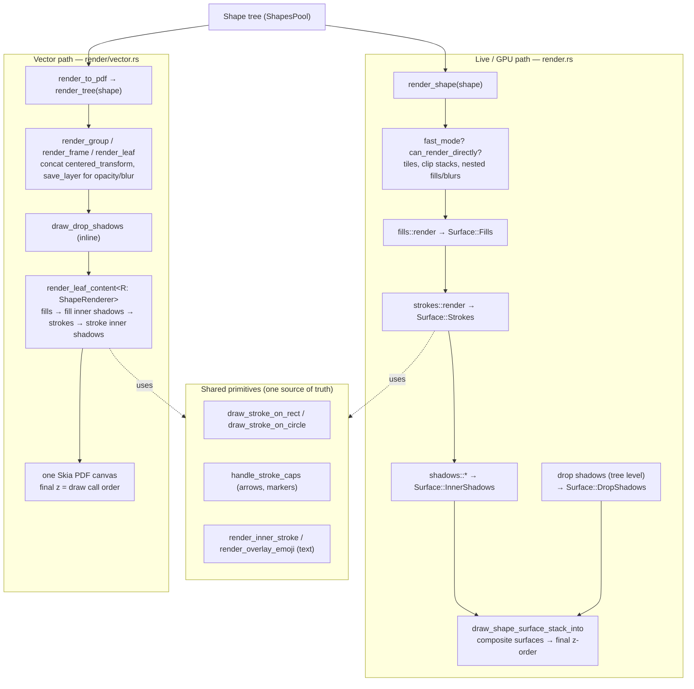

# Rendering Architecture: Live (GPU) vs Vector (PDF) Export

Penpot's WASM engine has **two render paths** that must produce the same picture:

| Path | Purpose | Backend | Code |
|------|---------|---------|------|
| **Live / GPU** | On-screen workspace, thumbnails, PNG export | WebGL surfaces + Skia | `render.rs::render_shape` (+ `render/{fills,strokes,shadows,text,...}.rs`) |
| **Vector** | True vector PDF (and future SVG) export | Single CPU Skia canvas (no GPU) | `render/vector.rs` → `render/pdf.rs` |

They share the same shape tree and the same low-level drawing primitives, but
compose them differently. Keeping them in sync is the whole game — see
[Parity guards](#parity-guards).

## Why two paths?

The live path draws each shape into **many intermediate GPU surfaces** (fills,
strokes, shadows, …) and composites them. Compositing rasterises. That is fine
for the screen and for PNG, but a PDF made that way would be a bitmap.

The vector path bypasses the GPU surface system and draws **directly onto a
Skia PDF canvas**, so paths, text and fills come out as real PDF vector
operations. Only inherently pixel-based effects (blur, blurred shadows) are
rasterised — by Skia's PDF backend, by design.

## The two pipelines

### Key differences

| Aspect | Live / GPU | Vector |
|--------|-----------|--------|
| Drawing target | Many GPU surfaces, then composited | One Skia PDF canvas |
| Final z-order | Surface composite order (`draw_shape_surface_stack_into`) | Order of draw calls |
| Drop shadows | Rendered at tree level into a separate surface (`render_element_drop_shadows_and_composite`) | Drawn inline per shape/container (`draw_drop_shadows` / `render_container_drop_shadows`) |
| Images | GPU textures | CPU image copies (`get_cpu_image`) |
| Blur / blurred shadow | GPU filter passes | Rasterised by Skia's PDF backend |
| Perf machinery | tiles, `fast_mode`, `can_render_directly` | none (one-shot export) |

## Export wiring (single vs multiple)

The client-side WASM export — rendering in the browser through the vector path
(`render_shape_pdf` / `render_shape_pixels`) — is wired **only for single
exports** (`request-simple-export` in `frontend/.../exports/assets.cljs`), and
only when render-wasm is active and the `:wasm-export` flag is set.

**Multiple/batch export** (`request-multiple-export`) always runs **server-side**
via the `:export-shapes` command; it merely passes an `:is-wasm` hint so the
server can use its own WASM renderer. So everything documented here (vector PDF,
the fixes, parity) applies to single export only.

## Parity guards

Three compile-time guards plus shared code keep the two paths from drifting.
The contract is documented on the `ShapeRenderer` trait
(`render/shape_renderer.rs`).

1. **Capability guard.** `ShapeRenderer` is the single declaration of per-shape
   rendering capabilities (`draw_fills`, `draw_strokes`, `draw_drop_shadows`,
   …). A new effect MUST be added as a trait method, not inline in
   `render_shape`. Adding a method fails to compile until the vector backend
   handles it — so a feature can never be silently missing from PDF.
2. **Type guard.** Every `match` on `shape.shape_type` in `vector.rs` is
   exhaustive (no `_ =>`). A new `Type` variant fails to compile until handled.
3. **Order guard.** Leaf content draw order/gating lives in exactly one place:
   `vector::render_leaf_content<R: ShapeRenderer>`. It is generic over the
   trait so the GPU backend could reuse it verbatim once it implements
   `ShapeRenderer`.
4. **Shared primitives.** Prefer reusing the live-render functions over
   mirroring them: `draw_stroke_on_rect`, `draw_stroke_on_circle`,
   `handle_stroke_caps`, `render_inner_stroke`, `render_overlay_emoji`.
   Whatever is still duplicated is the remaining drift surface.

### Not yet done — full unification

The end goal is for `render_shape` to also implement `ShapeRenderer` and route
its leaf rendering through `render_leaf_content`, so both paths share order and
gating by construction. This is a large refactor of the live hot path (tiles,
`fast_mode`, surface compositing, tree-level drop shadows) and **should be
gated by pixel parity tests** (a vector-vs-GPU raster diff harness lives on a
separate branch) — do not refactor the live path without that safety net.

## File map

| What | Where |
|------|-------|
| Vector entry / PDF | `render/pdf.rs`, `render/vector.rs` |
| Parity trait | `render/shape_renderer.rs` |
| Order seam | `render/vector.rs::render_leaf_content` |
| Live shape render | `render.rs::render_shape` |
| Surface compositing | `render.rs::draw_shape_surface_stack_into` |
| Shared stroke geometry / caps | `render/strokes.rs` |
| Shared text render | `render/text.rs` |
