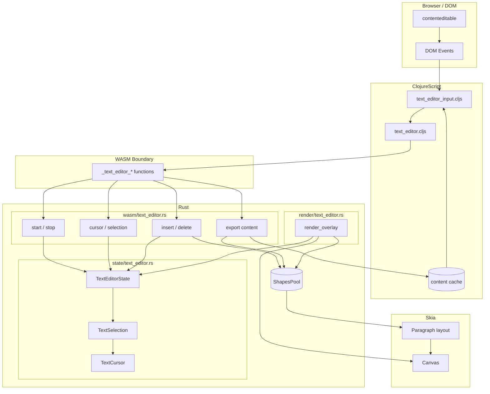
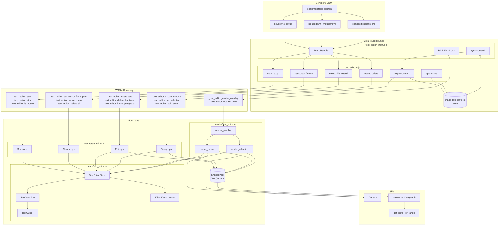

# Text Editor Architecture

## Overview (Simplified)

---

## Detailed Architecture

---

## Key Files

| Layer | File | Purpose |
|-------|------|---------|
| DOM | - | contenteditable captures keyboard/IME input |
| CLJS | `text_editor_input.cljs` | Event handling, blink loop, content sync |
| CLJS | `text_editor.cljs` | WASM bindings, content cache, style application |
| Rust | `state/text_editor.rs` | TextEditorState, TextSelection, TextCursor |
| Rust | `wasm/text_editor.rs` | WASM exported functions |
| Rust | `render/text_editor.rs` | Cursor & selection overlay rendering |

## Data Flow

1. **Input**: DOM events → ClojureScript handler → WASM function → Rust state
2. **Edit**: Rust modifies TextContent in ShapesPool → triggers layout
3. **Sync**: Export content → merge with cached styles → update shape
4. **Render**: RAF loop → render_overlay → Skia draws cursor/selection
