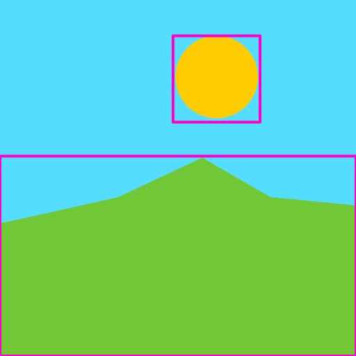
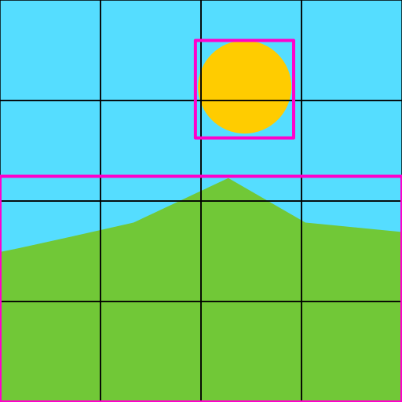

# Tile Rendering

## What is tile rendering?

Tile rendering consists in subdividing the screen into smaller areas called *tiles* and rendering them separately.

Why? Mainly for these reasons:

- **Progressive Rendering**: Only visible/needed parts are drawn.
- **Performance**: Tiles are currently rendered individually. In theory, this makes rendering parallelizable by reordering GPU call but we’re not doing this yet. GPU parallelization is complex, and we need to research it further (it likely depends on how the Skia backend is implemented).
- **Memory management**: Tiles are cached so that only the modified regions are re-rendered, while the rest remain intact and are reused as-is.
- **Interaction**: We render additional tiles beyond the visible area to ensure smoother user interaction, allowing users to move around without visible popping.

## How it works?

### Considerations

A *Tile* is a structure defined by two integer coordinates (*x*, *y*), identifying a cell within a virtual grid overlaying the canvas.

- Tile size (512px by 512px) is defined in logical screen-space units and is **independent of zoom**. However, it is also **DPR-independent** — rendering at high-DPI (e.g., Retina displays) will internally scale the canvas accordingly, but tiles remain 512×512 in logical units, not device pixels.
- Displacement is considered only in screen space. "Displacement" here refers to moving the viewport (panning), not translating shapes. All tile calculations and coordinates are based on screen-space movement.
- We always render a fixed number of tiles (determined by the size of the viewport area).

### What is a Viewbox?

The *Viewbox* represents the visible portion of the canvas in real (world) coordinates. It defines the area currently seen by the user through the viewport, including the zoom level and pan offset.

In tile rendering, the viewbox is used to determine which tiles are visible and should be rendered or cached.

### Key Structures

1. `Tile`: Identifies a cell in the grid.
2. `TileRect`: A rectangle of tiles defined by its top-left and bottom-right corners (x0, y0, x1, y1).
3. `TileViewbox`: Represents the visual area of interest:
   - `visible_rect`: Tiles currently visible in the viewport.
   - `interest_rect`: Extended area around the viewport for preloading.
   - `center`: The central tile of the current view.
4. `TileHashMap`: Maintains a dual index:
   - `Tile → Shape UUIDs`: Shapes occupying the tile.
   - `UUID → Tile Set`: Tiles containing the shape.
5. `Surface & TileTextureCache`: The surface system encapsulates multiple layers (fills, strokes, shadows, etc.) rendered onto temporary surfaces. Rendered tiles are captured as `skia::Image` instances in the `TileTextureCache` for reuse, avoiding redundant redraws.

These components allow efficient lookup and selective redrawing of what’s needed.

### Overview

Imagine a simple document like this:

It contains a background (sky color) and two shapes: the landscape and the sun.

### Bounding Boxes

A *bounding box* is the smallest rectangular area that fully contains a shape or group of shapes. For parent shapes, their bounding box typically extends to encompass all of their children, effectively covering the entire area occupied by the nested shapes.

Bounding boxes are crucial for tile rendering because they allow us to quickly determine which tiles a shape might intersect, without checking every individual pixel or path.

---

To render by tile, we need to determine which tiles each shape intersects. This is done using two related functions:

- `rebuild_tiles`: Calculates and associates tiles with shapes by analyzing their full bounding boxes, including all nested children. It provides a comprehensive mapping of where shapes lie on the tile grid.
- `rebuild_tiles_shallow`: Performs a lighter computation by associating tiles only with the first-level children of shapes. Deeper nested children are resolved dynamically during rendering. This approach improves performance by avoiding unnecessary calculations for tiles or shapes that may not be rendered.

In short, both functions help determine which tiles each shape occupies, but `rebuild_tiles_shallow` is optimized to reduce overhead for complex shape hierarchies.

Then, we compute which tiles need rendering:

> 💡 We use a `HashMap<Tile, Vec<Uuid>>` to track which shapes belong to each tile.

Once the tiles are determined, we sort them starting from the center of the viewport, using Manhattan distance to prioritize rendering closer tiles first, so the user can see the end result faster.

### Rendering Step-by-Step

1. Viewbox updates trigger a re-render, which happens on the initial render, user interactions (such as creating or moving shapes), panning, or zooming.
2. The `TileViewbox` is updated based on the new `Viewbox` (visible area plus margins of interest).
3. The system identifies tiles that are currently visible (`visible_rect`) and tiles just outside the viewport for preloading (`interest_rect`).
4. For each visible tile:
   - **If cached**:  
     - Draw the cached rendered tile directly from `TileTextureCache` to `Surface::Target`.
   - **If not cached**:
     - Fetch intersecting shapes using `TileHashMap`.
     - Render shape layers onto temporary surfaces:  
       - **Fills** → Shape fills  
       - **Strokes** → Outlines  
       - **Shadows** → Visual effects like drop or inner shadows to shapes   
       - **Current** → Composite tile layer (the final rendered tile before caching)
       - **Target** → Final canvas image where the composed tile is drawn; this is the surface ultimately displayed on screen after composing the tile layers.
     - Compose and cache the result using `cache_current_tile_texture(tile, image)`.
     - Copy the final tile image to `Surface::Target`.

### Rendering Across Multiple Frames

To avoid blocking the browser's main thread, tile rendering is distributed across multiple animation frames. This ensures smooth interactivity and responsiveness, even for large canvases or complex documents.

- Tiles are **sorted by priority** (typically using Manhattan distance to the viewport center).
- A limited number of tiles are rendered per frame based on a time or count budget.
- A limited number of tiles are rendered per animation frame based on either a time budget (to avoid blocking the main thread) or a maximum tile count, typically processing around 5–10 tiles per frame to balance performance and responsiveness.
- A limited number of tiles are rendered per animation frame. After processing every `NODE_BATCH_THRESHOLD` shapes, the system checks if the allotted time budget has been exceeded to decide whether to pause rendering and continue in the next frame. This approach avoids continuous time checks while preventing blocking the main thread.

- After each batch, control is yielded back to the browser to:
  - Allow UI updates
  - Handle user input
  - Maintain consistent frame rates

> 💡 This technique is similar to how map web apps or graphics engines progressively load and render content.

This incremental rendering strategy ensures:
- The most relevant (visible) tiles appear first.
- Remaining tiles are rendered progressively, minimizing perceived latency.
- The user interface remains responsive during rendering operations.

### Interaction and Updates

When a user interacts with a shape (creates, moves, or edits a shape):

- Tiles to be re-rendered are computed using the shape's bounding box.
- `TileHashMap` updates to reflect which shapes are rendered in each tile.
- Affected tiles are invalidated in the cache.
- Only those tiles are re-rendered.

When zooming or panning:

- New tiles entering the `visible_rect` are identified.

> 💡 `visible_rect` stores the current set of tiles that intersect with the viewbox — that is, the exact area visible on screen, without any margin of interest.

- These tiles are either:
  - Pulled from the cache, or  
  - Rendered from scratch if not already available.

### Handling Zoom and Scale

- Tile resolution depends on zoom level (`scale`).
- When zoomed in significantly, higher-resolution tiles are required.
- If the zoom changes beyond a threshold, the cache may be invalidated, and tiles re-rendered at the new scale.

## Why Cache Tiles?

Tile caching (via `TileTextureCache`) boosts performance:

- Prevents unnecessary rendering.
- Only a limited number of tiles are kept in memory (`TEXTURES_CACHE_CAPACITY`).
- Distant tiles are periodically evicted using an LRU (Least Recently Used)-like strategy based on visibility.

## Scaling and Tile Size Utilities

Tile size in screen space is constant, but its actual visual size depends on zoom level (`scale`).

To deal with this, the system uses utility functions:

- `get_tile_size(scale)`: Gets the logical size of a tile at the current scale.
- `get_tile_rect(tile, scale)`: Gets the rectangular area a tile covers.
- `get_tile_pos(tile, scale)`: Gets the tile’s position in canvas coordinates.

These allow rendering logic to adapt tile positions/sizes dynamically.

## Selective Re-rendering

The system enables:

- Efficient updates when the viewport changes.
- Targeted re-rendering when a shape changes (only the affected tiles).
- Reduced GPU/CPU work on complex documents.

## Rendering Pipeline Summary (Per Frame)

1. **Input**

Each rendering frame begins with the following inputs:

- `tree`: A mutable hashmap of all drawable shapes, keyed by UUID.
- `modifiers`: A hashmap of transformation matrices to apply to shapes, keyed by UUID.
- `structure`: A hashmap representing the shape hierarchy and their children.
- `Viewbox`: Defines the current viewport — the visible portion of the canvas, including zoom level and position.
- `timestamp`: A time marker used for animations and time-based updates.

2. **Compute `TileViewbox`**  
   - From `Viewbox`, generate visible + interest regions.

3. **Determine tiles to render**  
   - Compare tiles to be rendered vs cached ones.
   - Detect cache hits and misses.
   - Invalidate stale tiles if the viewport changed significantly.

4. **Render cached tiles**  
  - Fetch image from `TileTextureCache`.
  - Blit to `Surface::Target`.

5. **Render uncached tiles from scratch**  
  - Find the shapes intersecting with this tile (`TileHashMap`).
  - Render the tile layers on their `skia::Surface` instances, using blending, opacity, masking, etc. when needed.
  - Each layer is rendered on a `skia::Surface`.
  - Use blending, opacity, masking, etc.
  - Store the resulting texture in the cache:  
    `cache_current_tile_texture(tile, image)`
  - Draw the tile to `Surface::Target`.

6. **Handle user interactions**  
   - When shapes are modified:
     1. Determine affected tiles.
     2. Invalidate those tiles in the cache.
     3. Re-render them selectively.
   - When panning or zooming:
     - Detect the visible tiles.
     - Fetch them from the cache or render them if needed.

## Summary of Benefits

- **Modular pipeline**: It separates surfaces per layer, enabling composite rendering.
- **Avoid unnecessary re-renders**: A cache is used to avoid re-rendering when nothing has changed.
- **Progressive**: Only visible/nearby tiles are drawn.
- **Efficient**: Selective invalidation of cached tiles minimizes GPU/CPU usage on large documents.
- **Scalable with screen siz**: Works well for both small and large canvases due to tile granularity and smart caching.

## References

- [Chromium Tile Prioritization Design](https://docs.google.com/document/d/1tkwOlSlXiR320dFufuA_M-RF9L5LxFWmZFg5oW35rZk/edit?tab=t.0)
- [WebGL Best Practices](https://developer.mozilla.org/en-US/docs/Web/API/WebGL_API/WebGL_best_practices)
- [When Optimisations Work, But for the Wrong Reasons](https://www.youtube.com/watch?v=hf27qsQPRLQ&ab_channel=SimonDev)
- [Life of a Triangle](https://pixeljetstream.blogspot.com/2015/02/life-of-triangle-nvidias-logical.html)
- [A Trip Through the Graphics Pipeline 2011](https://fgiesen.wordpress.com/2011/07/09/a-trip-through-the-graphics-pipeline-2011-index/)